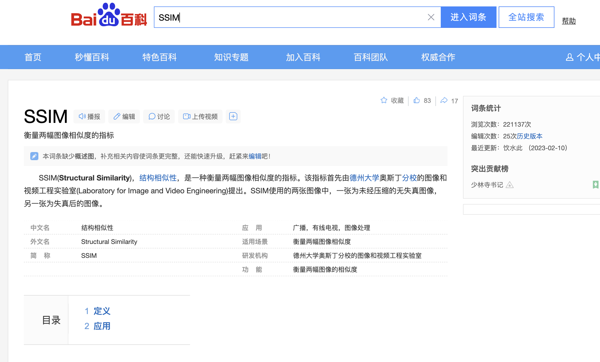
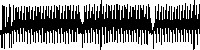
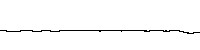

# 保形度量指标：SSIM

# 保形测试：示例

-   数据集：MF03

    -   来源：Z. Jerzak , T. Heinze, M. Fehr, D. Gr¨ber, R . Har tung, and N. Stojanovic. The DEBS2012 Grand Challenge. In DEBS, pages 393–398. ACM, 2012. https://debs.org/grand-challenges/2012/. 提取第一列和第五列得到传感器MF03（即电力主相3）以100Hz频率左右采集的制造设备监控数据。
    -   特点：混合信号，包含低、高和突发变化

-   测试输入：100万点的原始时间序列csv文件'MF03.csv'，使用等间隔采样得到的800点的采样序列csv文件'sampled.csv'

-   测试过程：用原始时间序列画出折线图f1，用采样序列画出折线图f2，然后用`SSIM(f1,f2)`来度量这两张图之间的相似度，用于评价采样算法的保形效果。

-   测试结果：

    -   原始序列折线图f1：
    
        
    
    -   采样序列折线图f2：
    
        
    
    -   计算`SSIM(f1,f2)=0.0109`，接近0，表示采样算法的保形效果差。

# 使用指导

把“保形bench.ipynb”里的`original="MF03.csv"`替换成实际的原始序列csv文件路径、`sampled="sampled.csv"`替换成实际的采样序列csv文件路径，然后运行后续代码即可得到用于评价采样算法保形效果的SSIM值。

